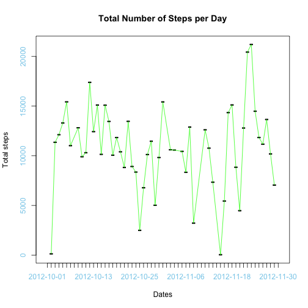
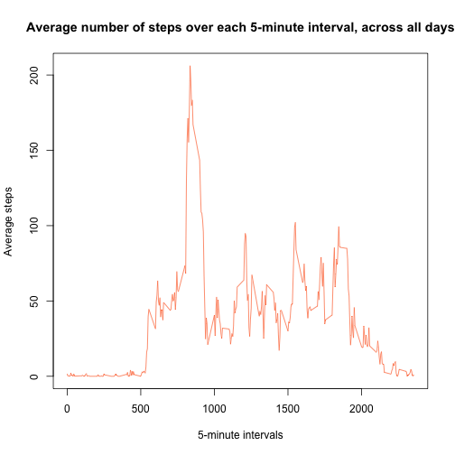
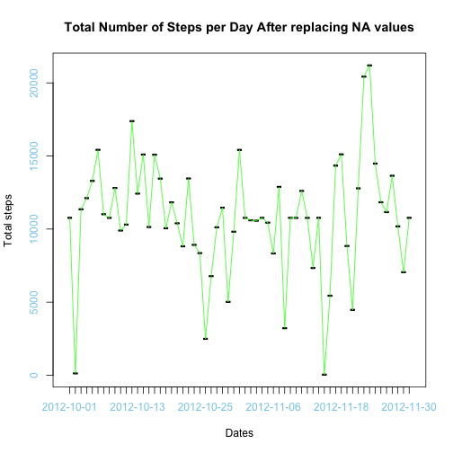

Project Assignment 1
=========================

Load the data from the input 'activity' file


```r
activity <- read.csv("activity.csv")
```

```
## Warning in file(file, "rt"): cannot open file 'activity.csv': No such file
## or directory
```

```
## Error in file(file, "rt"): cannot open the connection
```

**Section 1. For this part of the assignment, we should ignore the missing values in the dataset.**

**Part 1. What is mean total number of steps taken per day?**

Cleaning the data to remove NA values


```r
clean_data <- activity[complete.cases(activity), ]
```

Calculating total steps per day


```r
daily_steps_total <- aggregate(clean_data$steps, by=list(Category=clean_data$date), FUN=sum)
```

**Histogram of the total number of steps taken each day**


```r
plot(daily_steps_total$Category, daily_steps_total$x, col.axis = "sky blue", xlab="Dates", ylab="Total steps")
title("Total Number of Steps per Day")
lines(daily_steps_total$Category, daily_steps_total$x, type="l", col="Green")
```

 

**Calculating mean and median of steps taken per day**


```r
cat("The mean of steps taken per day is: ", mean(daily_steps_total$x), " and median is: ", median(daily_steps_total$x), "\n")
```

```
## The mean of steps taken per day is:  10766.19  and median is:  10765
```

**Part 2: What is the average daily activity pattern?**

**Time series plot of the 5-minute interval and the average number of steps taken, averaged across all days**


```r
average_steps_across_intervals <- aggregate(clean_data$steps, by=list(Category=clean_data$interval), FUN=mean)
plot(average_steps_across_intervals$Category, average_steps_across_intervals$x, type="l", xlab="5-minute intervals", ylab="Average steps", col="Coral")
title("Average number of steps over each 5-minute interval, across all days")
```

 

**5-minute interval containing maximum number of steps**


```r
period_of_max_walking <- average_steps_across_intervals$Category[average_steps_across_intervals$x == max(average_steps_across_intervals$x)]

cat("5-minute interval containing maximum number of steps is: ", period_of_max_walking, "\n")
```

```
## 5-minute interval containing maximum number of steps is:  835
```

**Section 2. For this part of the assignment, we will replace the missing values with mean values.**

**Calculate and report the total number of missing values in the dataset**


```r
number_of_entries_with_NAs <- sum(!complete.cases(activity))
cat("Total number of missing values in the dataset is: ", number_of_entries_with_NAs, "\n")
```

```
## Total number of missing values in the dataset is:  2304
```

**Strategy for filling in all of the missing values**

In this scenario, we need to consider those entries too, which have NA values for steps data.
 One option is to impute missing values with mean (or median) values with mean (or median) values, calculated above.
 However, I believe that this would be inaccurate. Let us assume that a person is fairly inactive for duration 0 [between 12:00 midnight and 12:05 am], and quite active at 900 
 [between 9:00am and 9:05am]. Hence, replacing the NA value for interval 0 with the mean value for entire day would be quite inaccurate.
 
 Hence I first calculate mean values for each interval using only valid values. And then impute NA values with these mean values.

**Create a new dataset that is equal to the original dataset but with the missing data filled in.**


```r
interval_steps_mean <- aggregate(clean_data$steps, by=list(Category=clean_data$interval), FUN=mean)

complete_set <- activity
for (i in 1:nrow(complete_set)) {
        if(is.na(complete_set$steps[i])) {
                interval <- complete_set$interval[i];
                mean_steps <- interval_steps_mean$x[interval_steps_mean$Category==interval]
                complete_set$steps[i] <- mean_steps
        }
}
```

**Part 1. What is mean total number of steps taken per day?**

**Histogram of the total number of steps taken each day**


```r
new_daily_steps_total <- aggregate(complete_set$steps, by=list(Category=complete_set$date), FUN=sum)
plot(new_daily_steps_total$Category, new_daily_steps_total$x, col.axis = "sky blue", xlab="Dates", ylab="Total steps")
title("Total Number of Steps per Day After replacing NA values")
lines(new_daily_steps_total$Category, new_daily_steps_total$x, type="l", col="Green")
```

 

**Calculating mean and median of steps taken per day**


```r
cat("After imputing NAs, the mean of steps taken per day is: ", mean(new_daily_steps_total$x), " and median is: ", median(new_daily_steps_total$x), "\n")
```

```
## After imputing NAs, the mean of steps taken per day is:  10766.19  and median is:  10766.19
```

**Part 3.Are there differences in activity patterns between weekdays and weekends?**

**1. Create a new factor variable in the dataset with two levels – “weekday” and “weekend” indicating whether a given date is a weekday or weekend day**


```r
complete_set$days <- weekdays(as.Date(complete_set$date))
var <- "days"

two_level <- complete_set
two_level[,var] <- sapply(two_level[,var],function(x) ifelse(x=="Saturday","weekend",x))
two_level[,var] <- sapply(two_level[,var],function(x) ifelse(x=="Sunday","weekend",x))
two_level[,var] <- sapply(two_level[,var],function(x) ifelse(x=="weekend",x, "weekday"))

weekday_data <- subset(two_level, two_level$days == "weekday")
weekend_data <- subset(two_level, two_level$days == "weekend")
```

**2. Panel plot containing a time series of average number of steps, over weekday and weekend, taken over each 5-minute interval**


```r
weekday_average_steps_across_intervals <- aggregate(weekday_data$steps, by=list(Category=weekday_data$interval), FUN=mean)
weekend_average_steps_across_intervals <- aggregate(weekend_data$steps, by=list(Category=weekend_data$interval), FUN=mean)

par(mfrow=c(2,1))
xlab="5-minute intervals"
ylab="Average steps"

plot(weekday_average_steps_across_intervals$Category, weekday_average_steps_across_intervals$x, type="l", col = "blue", xlab=xlab, ylab=ylab, main="Average number of steps over Weekdays")

plot(weekend_average_steps_across_intervals$Category, weekend_average_steps_across_intervals$x, type="l", col = "blue", xlab=xlab, ylab=ylab, main="Average number of steps over Weekend")
```

 
